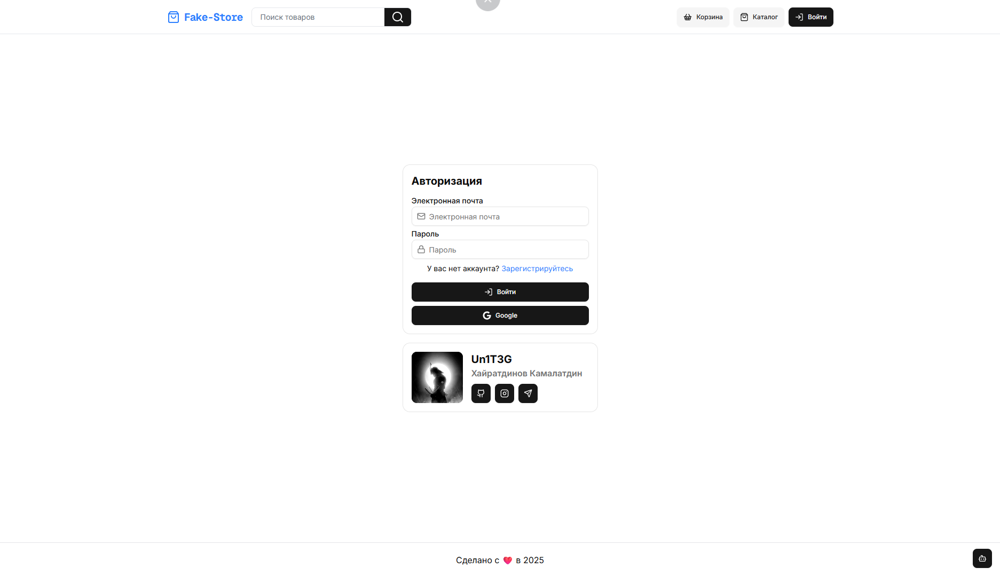
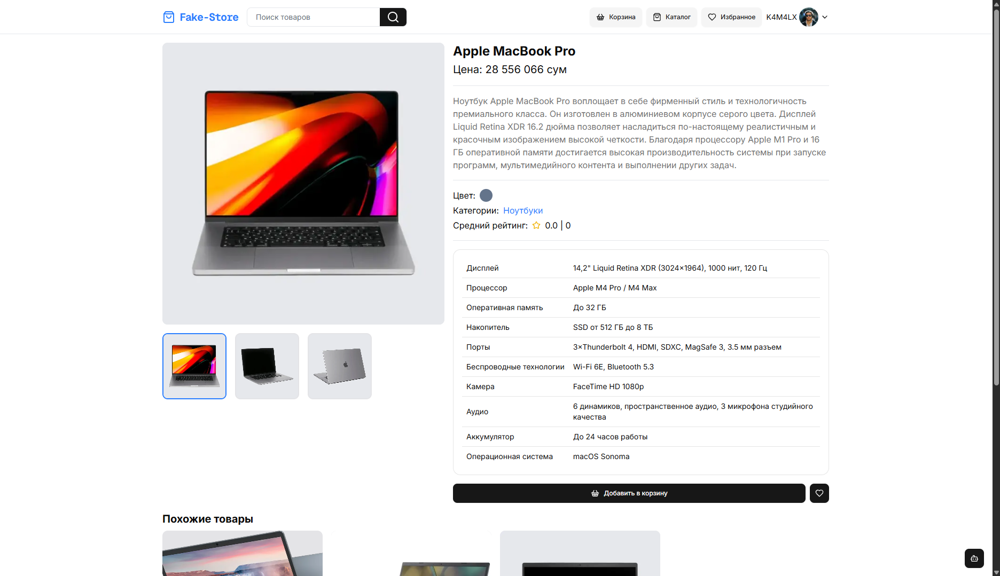
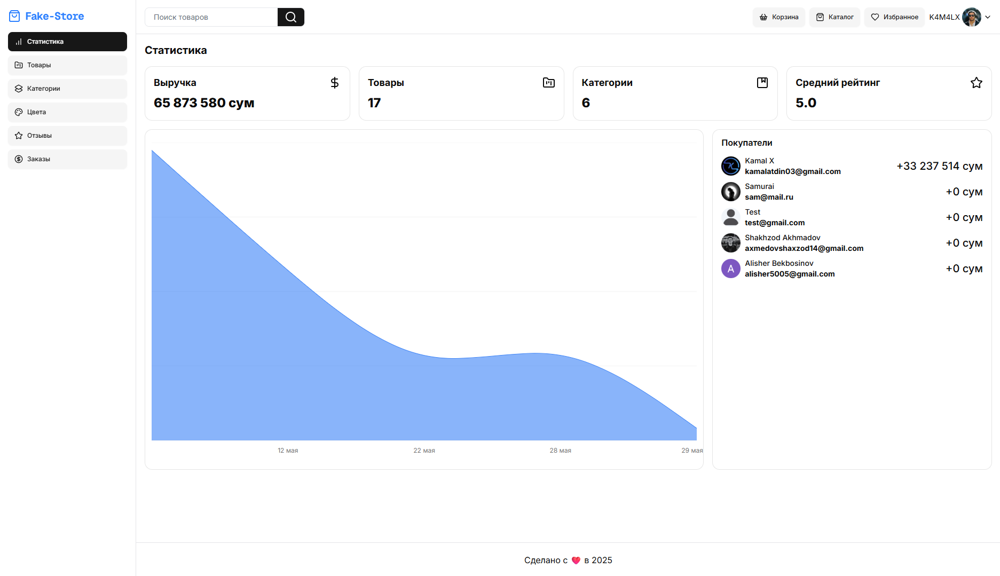
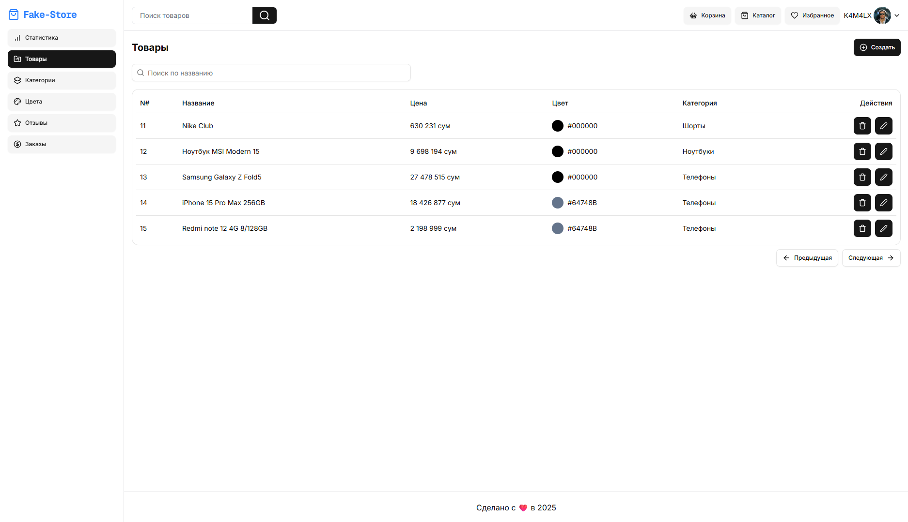
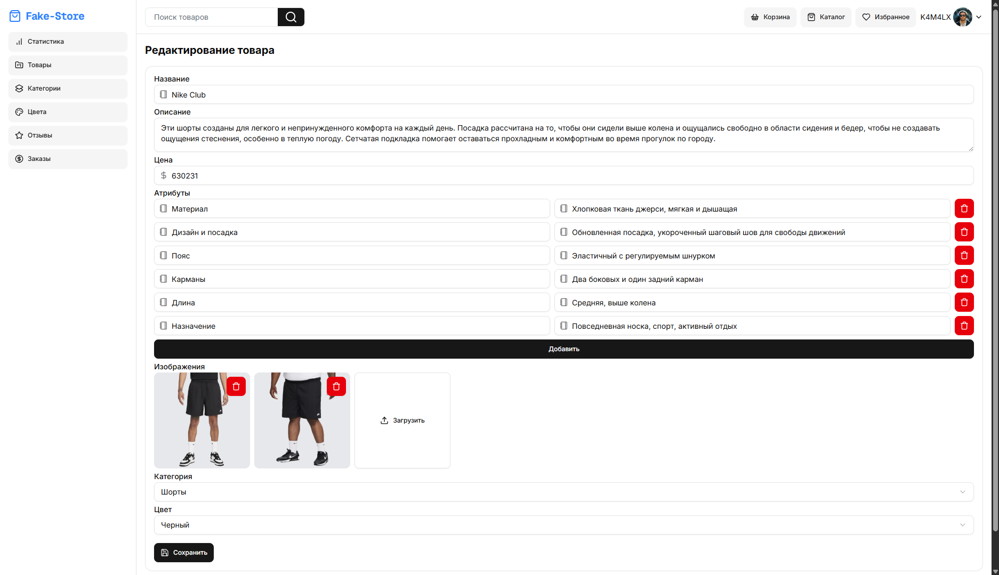

# 🛍️ Online-Store

Интерактивное веб-приложение интернет-магазина с административной панелью, возможностью оставлять отзывы, добавлять товары в избранное и встроенным чат-ботом для помощи в навигации по каталогу.

---

## 🚀 Функциональность

### 🧾 Для пользователей:

- Просмотр товаров с фильтрацией по категориям, цветам и брендам
- Поиск товаров по названию
- Возможность оставлять отзывы к каждому товару
- Добавление товаров в избранное
- Интеграция с чат-ботом:
  > Пример: _"У вас есть продукция Apple?"_ → бот отобразит все товары, связанные с Apple

---

### ⚙️ Для администраторов:

- Панель администратора с авторизацией
- CRUD для:
  - Товаров
  - Категорий
  - Цветов товаров
- Просмотр ежемесячной статистики продаж (таблицы, графики)

---

## 📦 Технологии

- **Frontend:** React / Next.js / TypeScript
- **Backend:** Node.js / NestJS / Prisma
- **База данных:** PostgreSQL
- **Аутентификация:** JWT / Role-based access
- **Чат-бот:** NLP-модуль на основе OpenAI или Dialogflow
- **UI-библиотека:** Tailwind CSS / shadcn/ui

---

## 📷 Скриншоты










---

## 🛠 Установка и запуск

```bash
# Клонировать репозиторий
git clone https://github.com/your-username/online-store.git
cd online-store

# Установить зависимости
npm install

# Запустить проект
npm run dev
```
